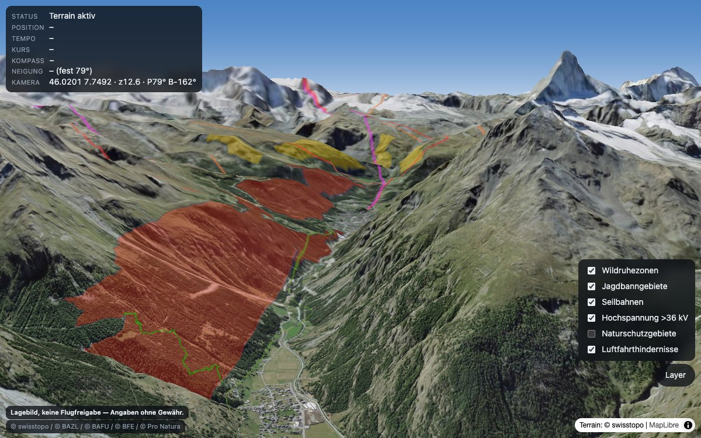

# FPV Sperrzonen-Cockpit

Live nachgeführte 3D-Kartenansicht der Schweiz mit Drohnen-relevanten Sperr- und
Hinweisflächen. Läuft während der Fahrt auf dem iPhone oder iPad: die Karte folgt
Position und Blickrichtung, das Gelände ist echtes swisstopo-Terrain, und die
Kamera kippt mit dem Gerät.

**→ [maetthum.github.io/Drone-Cockpit](https://maetthum.github.io/Drone-Cockpit/)**



> **Informatives Lagebild, keine Flugfreigabe.**
> Zonen, Höhen und Positionen können unvollständig, veraltet oder fehlerhaft
> sein — unter 36 kV sind Stromleitungen gar nicht erfasst. Massgebend sind
> allein die amtlichen Angaben von BAZL und Kantonen sowie die geltenden
> Vorschriften. Die Verantwortung für jeden Flug liegt bei der steuernden Person.

## Was es tut

- **3D-Gelände** von swisstopo (Quantized-Mesh), Luftbild als Untergrund, echter Himmel statt Hintergrundfarbe.
- **Folgt live** der GPS-Position. Die Blickrichtung kommt in Fahrt aus dem GPS-Bewegungsvektor, im Stillstand aus dem Magnetometer — mit Hysterese, damit die Quelle im Schritttempo nicht flattert, und mit Überblendung, damit der Wechsel nicht als Sprung sichtbar wird.
- **Fast waagrechter Blick nach vorn**, nicht von oben herab — so sieht man, was vor einem liegt. Neigung und Zoom stehen im Tracking fest und ändern sich nur auf Fingergeste; die Lage des Geräts spielt bewusst keine Rolle, sonst wackelt die Ansicht in der Halterung mit.
- **Zwei Regler für die Kamera**: „Vor" schiebt den eigenen Punkt im Bild nach unten, bis die Kamera praktisch auf ihm steht; „Höhe" setzt die Kamerahöhe in Metern über dem eigenen Standort.
- **Die Kamera bleibt über Grund.** Bei fast waagrechtem Blick sitzt sie knapp über dem Boden und rutschte sonst in ansteigendes Gelände — man sieht den Berg dann von innen. Reicht die Bodenfreiheit nicht, nimmt die App die Neigung so weit zurück, bis sie wieder passt.
- **Sperr- und Hinweisflächen** als Overlay, einzeln schaltbar (siehe Datenquellen).
- **Luftfahrthindernisse als Vektor**, eingefärbt nach Höhe über Grund.
- **Antippen beantwortet „was gilt hier?"** — die Karte zeigt Flächen, die Regel
  steht in den Sachdaten. Ein Tipp fragt die eingeschalteten Layer am Ort ab und
  zeigt den Klartext, etwa „Der Betrieb von unbemannten Luftfahrzeugen mit einem
  Gewicht von mehr als 250 g ist ab einer Höhe von 120 m über Grund verboten",
  samt Höhenband und zuständiger Stelle.
- **Installierbar und offline startfähig**: zum Home-Bildschirm hinzufügen, dann
  läuft sie im Vollbild. Die App-Hülle liegt im Cache, Kartenkacheln sammeln sich
  im Betrieb — eine einmal gefahrene Strecke ist im Funkloch wieder da.
- Kein Backend, kein Build-Schritt, keine Toolchain: statische Dateien, die GitHub Pages unverändert ausliefert.

## Bedienung

Zwei Modi:

- **Tracking** — die Karte führt selbst. Kneifen und Zwei-Finger-Neigen greifen
  trotzdem: solange Finger auf der Karte liegen, schweigt die Kameraführung.
  Verschieben und Drehen sind gesperrt, sie würden gegen den Frame-Takt laufen.
- **Manuell** — die Kamera gehört dem Finger: verschieben, kneifen, drehen, neigen.

| Geste / Knopf | Wirkung |
|---|---|
| Kneifen (zwei Finger) | Zoom |
| Zwei Finger parallel hoch/runter | Neigung — bleibt danach so stehen |
| Ein Finger ziehen | Verschieben (nur im Manuell-Modus) |
| Auf die Karte tippen | Zeigt, was an dieser Stelle gilt |
| Regler „Vor" | Von Übersicht bis Kamera auf dem eigenen Standort |
| Regler „Höhe" | Kamerahöhe über dem eigenen Standort, in Metern |
| „Zu mir" | Zurück auf die eigene Position, ohne den Modus zu wechseln |
| „Layer" | Overlays einzeln ein- und ausschalten |

Die eigene Position zeigt ein blauer Pfeil in Fahrtrichtung. Er steht aufrecht
zum Bildschirm — flach auf das Gelände gelegt läge er bei fast waagrechtem Blick
in der Blickachse und wäre kaum zu sehen. Ist kein Kurs bekannt, erscheint statt
des Pfeils ein Punkt: eine gezeichnete Richtung ohne Datengrundlage wäre gelogen.

HUD und Kameralage starten eingeklappt; je ein kleines Eck am linken Rand blendet
sie ein. Im Manuell-Modus kommen „Zu mir" und ein Kompass dazu, der die Karte
nach Norden ausrichtet.

## Datenquellen

Bis auf das Wetterradar alles über [geo.admin.ch](https://www.geo.admin.ch),
Quellenangabe verpflichtend (opendata.swiss `terms_by`).

| Layer | Quelle | Dienst | Vorgabe |
|---|---|---|---|
| Terrain (Quantized-Mesh) | swisstopo | 3D-Tiles | — |
| Luftbild swissimage | swisstopo | WMTS | — |
| **Einschränkungen für Drohnen** | BAZL | WMTS | an |
| Wildruhezonen | BAFU | WMTS | an |
| UAS-Aktivitätszonen | BAZL | WMS | an |
| Schiessanzeigen + Gefahrenzonen | VBS | WMTS | an |
| Seilbahnen (swissTLM3D) | swisstopo | WMTS | an |
| Hochspannung >36 kV | BFE | WMS | an |
| Luftfahrthindernisse | BAZL | GeoJSON (identify) | an |
| Windenergieanlagen | BFE | WMS | aus |
| Hindernisbegrenzungsflächen | BAZL | WMS | aus |
| Moorlandschaften, Auen, BLN, Waldreservate | BAFU | WMTS | aus |
| Gewässer (kant. Regeln) | swisstopo | WMTS | aus |
| Niederschlagsradar | RainViewer | XYZ-Kacheln | aus |

**Bewusst nicht enthalten** sind Layer, welche die BAZL-Drohnenkarte bereits
selbst führt. Sie ist eine Sammelkarte mit drei Kategorien — `NATURE`,
`SENSITIVE` und `AIR_TRAFFIC` — und deckt damit Nationalpark, Jagdbanngebiete,
Wasser- und Zugvogelreservate, Kontrollzonen, Flugplätze und Spitallandeplätze
ab. Ein eigener Layer dafür wäre eine Doppelnennung. Die Ausnahme sind
**Wildruhezonen**: sie sind kantonal geregelt und fehlen der Bundeskarte.

Die BAZL-Drohnenkarte enthält laut Datensatzbeschrieb auch **kantonale**
Einschränkungen (Art. 34 der UVEK-Verordnung) und wird viermal täglich
nachgeführt. Nicht darin enthalten sind kantonale Regeln ohne eigene UAS-Zone —
etwa die Gewässerbestimmungen mehrerer Kantone. Dafür ist der Gewässer-Layer da:
er zeigt, *wo* solche Regeln greifen; *was* gilt, steht im kantonalen Recht.

Die Luftfahrthindernisse kommen bewusst nicht als Raster: der WMS-Layer stempelt
„Last update: …" in jedes ausgelieferte Bild, bei Kachelbetrieb also in jede
Kachel. Der identify-Dienst liefert dieselben Objekte sauber und dazu die Höhe
über Grund je Hindernis.

### Wetterradar

Das Niederschlagsradar ist die einzige Schicht ausserhalb von geo.admin.ch.
MeteoSchweiz veröffentlicht seine Radardaten zwar offen
(`ch.meteoschweiz.ogd-radar-precip`, CC-BY), aber als HDF5-Dateien — ein Format,
das kein Browser darstellt und das einen Server zur Aufbereitung bräuchte. Das
widerspricht dem Grundsatz „statisch, kein Backend".

[RainViewer](https://www.rainviewer.com/) liefert dieselben Messungen als
fertige Kacheln: dessen Abdeckungsliste nennt fünf Radarstandorte in der
Schweiz, und MeteoSchweiz betreibt genau fünf. Das Bild ist rund zehn Minuten
alt und löst etwa einen Kilometer auf. **Bedingung der freien Nutzung ist die
Namensnennung** — sie hängt an der Kartenquelle und erscheint, sobald der Layer
eingeschaltet ist.

Eine Wolkendecke gibt es nicht: weder geo.admin.ch noch RainViewers freier
Zugang führen aktuelle Satellitenbilder.

## Stand

Alle geplanten Phasen sind abgeschlossen und live. Die Kameraführung ist am
Gerät nachgemessen: Startzeit, Bildrate, Zittern und Bezugspunkt der Kamerahöhe
sind jeweils gegen Messwerte belegt, nicht geschätzt.

Referenztempo ist **120 km/h**. Nachgeladen wird, sobald die Kamera ein Viertel
der Bildbreite zurückgelegt hat — bei diesem Tempo etwa alle vier Sekunden.
Zusätzlich lädt die App gestaffelt vor: zuerst rund um den eigenen Standort,
dann in Blickrichtung immer weiter hinaus und dabei zunehmend gröber.

Was bleibt, ist physikalisch und nicht wegzuprogrammieren: das Magnetometer
liefert den Kurs in groben Stufen, und weil die Kamera vor dem eigenen Punkt
steht, wird daraus ein sichtbarer seitlicher Schwenk. Der Ankerversatz ist
deshalb gedeckelt; wer es noch ruhiger will, zieht den Regler „Vor" zurück.

Bewusst nicht vorgesehen: eine berechnete Höhe über Grund und Zonen als
schwebende 3D-Volumen. Beides wurde gebaut und wieder verworfen — die Flächen
auf dem Gelände sind im Cockpit besser lesbar als Körper, die über der Karte
stehen.

## Lokal starten

```sh
npx http-server -p 8099 -s .
# → http://127.0.0.1:8099
```

Standort und Kompass brauchen einen *secure context*: über die Live-URL oder
`localhost` funktionieren sie, über `http://<LAN-IP>` nicht. Für Tests am Gerät
mit ungepushtem Stand braucht es deshalb einen lokalen HTTPS-Server mit
selbstsigniertem Zertifikat.

## Test

```sh
npx http-server -p 8099 -s . &
NODE_PATH=$(npm root -g) node test/smoke.mjs
```

Playwright-Smoke-Test mit gestubbten Endpunkten und skriptbarer Fake-Sensorik.
Er prüft die Verdrahtung und das *Regelverhalten* der Kameraführung — Dämpfung
des GPS-Rauschens im Stand, Dauer des Quellenwechsels, Neigungssteuerung — nicht
die Korrektheit der Layer-IDs und nicht echte Sensorik. `SMOKE_URL` richtet ihn
auf eine andere Adresse, etwa die deployte Seite.

## Aufbau

```
index.html        HUD- und Overlay-Markup
src/config.js     einzige Quelle für Endpunkte, Layer-IDs und Konstanten
src/map.js        Kartenaufbau, Basemap, Terrain, Himmel
src/terrain.js    Brücke zum Terrain-Worker
src/terrain-worker.js   Quantized-Mesh-Resampling neben dem Hauptthread
src/geolocation.js / src/compass.js   Sensor-Adapter (Position, Kurs, Neigung)
src/follow.js     Quellenwahl, Glättung, Kameraführung im Frame-Takt
src/overlays.js   Raster-Overlays (WMTS/WMS) samt Verfügbarkeitsprüfung
src/obstacles.js  Luftfahrthindernisse als Vektor
src/radar.js      Niederschlagsradar (zeitabhängige Kacheln)
src/prefetch.js   Kacheln in Fahrtrichtung vorladen
src/me.js         eigene Position: Punkt und Richtungspfeil
src/info.js       Antippen-Abfrage: was gilt an dieser Stelle
sw.js             Service-Worker: App-Hülle offline, Kachelvorrat
manifest.webmanifest / icons/
src/main.js       Bootstrap, HUD, Fehleranzeige
vendor/           MapLibre GL JS, Terrain-Plugin, QM-Decoder — unverändert
```

## Lizenz

MIT, siehe [LICENSE](LICENSE). Gilt **nicht** für `vendor/` — MapLibre GL JS,
`maplibre-gl-3dtiles-terrain` und `@here/quantized-mesh-decoder` stehen unter
ihren eigenen Lizenzen, die dort beiliegen. Die Kartendaten gehören swisstopo,
BAZL, BAFU, BFE und dem VBS; die Radarbilder stammen von RainViewer.
